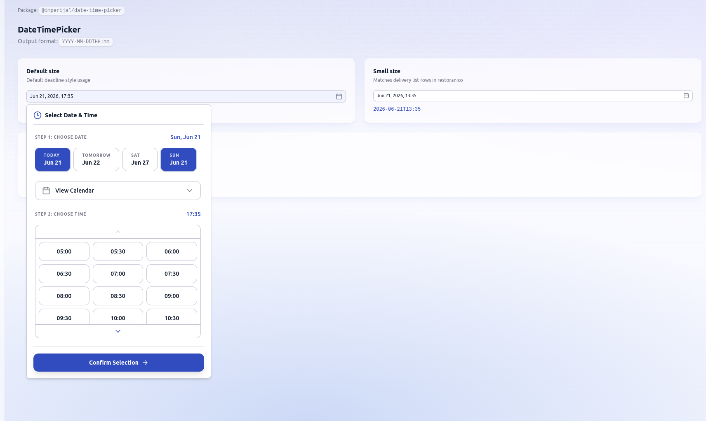

# imperijal-components

Monorepo of reusable React UI packages published under the `@imperijal/*` scope.



## Documentation

| Guide | Purpose |
|-------|---------|
| [**VERSIONING.md**](./VERSIONING.md) | Bump version, publish, update apps |
| [**CUSTOMIZATION.md**](./CUSTOMIZATION.md) | Tailwind setup, props, theming |
| [**DEMO.md**](./DEMO.md) | Local demo app, v2 iteration, public preview for npm users |
| [**INSTALL_AND_USAGE.md**](./INSTALL_AND_USAGE.md) | Install in an app + component usage |
| [**PUBLISHING.md**](./PUBLISHING.md) | Publish to npm + fix E403 / 2FA errors |

## Quick start — local demo

```bash
pnpm install
pnpm demo
```

Opens http://localhost:5173 — edit `packages/date-time-picker/src/` and see changes live.

## Packages

| Package | Description |
|---------|-------------|
| [`@imperijal/date-time-picker`](./packages/date-time-picker) | Date & time picker (`YYYY-MM-DDTHH:mm`) |

## Development

```bash
pnpm install
pnpm build
```

## Adding a new component

```bash
mkdir -p packages/my-component/src
# add package.json, tsconfig, tsup.config.ts
# register in pnpm-workspace.yaml (already uses packages/*)
```

## Publishing

See [PUBLISHING.md](./PUBLISHING.md). **Never** run `npm publish` from this root folder.
